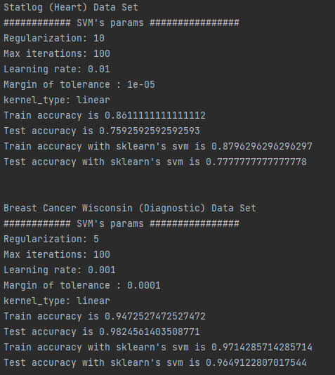

# Semester Project: Support Vector Machine
Build an SVM to model the prediction process programmatically using classification and regression models.

## Datasets Used:

### 1. Statlog (Heart) 
This is a heart disease database including 13 different features (age, sex, chest pain type, etc.). There are 270 samples in total, in which the training set contains 216 samples (80%) while the test set contains the remaining 54 (20%). The goal is for the support vector machine to predict if a patient has heart disease or not.

### 2. Breast Cancer Wisconsin (Diagnostic)
This is the Diagnostic Wisconsin Breast Cancer Database with 30 different features computed for each cell nucleus. They include attribute information about radius (mean of distances from center to points on the perimeter), texture (standard deviation of gray-scale values), perimeter, area, smoothness (local variation in radius lengths), etc. Similar to train test split (80/20) in Statlog (Heart), there are 569 samples in total, in which the training set contains 455 samples while the test set contains the remaining 114. The goal is to predict if a patient has breast cancer or not.

## Support Vector Machine Classification:

## Support Vector Machine Regression: 

## Compilation:

Use `pip install -r requirements.txt` to install all the required dependancies for this project.

Run the program in terminal in the appropriate directory using `py main.py`.

## Results And Going Forward:

### Linear kernel

## References:

## Made By Machine Partners:

Thang Le, Tri Pham, Apurva Rai and Warren Wang.
