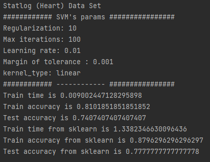
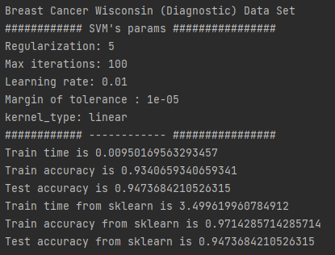
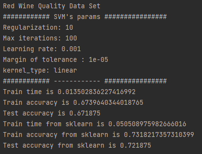
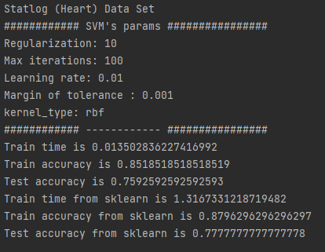
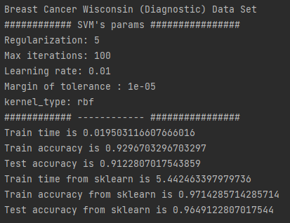
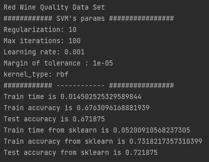

# Semester Project: Support Vector Machine
Build an SVM to model the prediction process programmatically using classification models.

## Datasets Used:

### 1. Statlog (Heart) 
This is a heart disease database including 13 different features (age, sex, chest pain type, etc.). There are 270 samples in total, in which the training set contains 216 samples (80%) while the test set contains the remaining 54 (20%). The goal is for the support vector machine to predict if a patient has heart disease or not.

### 2. Breast Cancer Wisconsin (Diagnostic)
This is the Diagnostic Wisconsin Breast Cancer Database with 30 different features computed for each cell nucleus. They include attribute information about radius (mean of distances from center to points on the perimeter), texture (standard deviation of gray-scale values), perimeter, area, smoothness (local variation in radius lengths), etc. Similar to train test split (80/20) in Statlog (Heart), there are 569 samples in total, in which the training set contains 455 samples while the test set contains the remaining 114. The goal is to predict if a patient has breast cancer or not.

### 3. Red Wine Quality
This is the red wine quality database with 11 different features. They include information such as acidity, density, pH, etc. based on physicochemical tests. There are 1599 instances in total, and we split them into 1279 instances for our train set and the remaining 320 instances for our test set. The goal is to predict if a test sample is of excellent or poor wine quality.

## Support Vector Machine Classification:

Consider a linear classifier for a binary classification problem with target y (either -1 or 1) and feature x. An SVM computes a linear classifier of the form f(x) = WTx + b. From here, we can predict that if f(x) > 0, then y=1. Otherwise, y= -1. We can also express f using inner product where f(x) = &Sigma;(i = 1 -> m) [&alpha;i y(i) <x(i), x> + b]. &alpha;i is a Lagrange multiplier for solution and <x(i), x> is the inner product of x(i) and x. This inner product could also be replaced with different Kernel functions for better optimization.

The main algorithm behind the implementation for SVM classification is John Platt's Sequential Minimal Optimization (SMO). In this project, we implemented a simplified version of SMO. The algorithm works by breaking down the SVM optimization problem into many smaller optimization problems that are easier to solve. SMO selects two Lagrange multiplier values (&alpha;i and &alpha;j) and optimize them. Once these two are optimized, the threshold value b is updated and another two are chosen and optimized over. The process is repeated until the &alpha;'s converge.

## Compilation:

Use `pip install -r requirements.txt` to install all the required dependancies for this project.

Run the program in terminal in the appropriate directory using `py main.py`.

## Results And Going Forward:

We decided to go for a trade off between accuracy and speed. While the accuracy is not as good as that of an sklearn's model, it is good to see that our implementation could run relatively faster. That being said, we hope to look more into improving the accuracy while maintaining this significant speed.

We recently added the one-vs-rest method for multiclass classification, but the method has not given us better result than binary classification. Our expansion of kernel for linear, polynomial, and rbf has been tested. Going forward, we will continue improving the accuracy for both binary and multiclass classification.

In general, SVM is a powerful approach for classification. The idea of trying to find separability of data in higher dimension has made SVM an efficient and widely used approach.

### Linear kernel

### RBF kernel

## References:

https://aihubprojects.com/svm-from-scratch-python/

http://cs229.stanford.edu/materials/smo.pdf

https://shuzhanfan.github.io/2018/05/understanding-mathematics-behind-support-vector-machines/

https://ai6034.mit.edu/wiki/images/SVM_and_Boosting.pdf

https://jonchar.net/notebooks/SVM/

https://archive.ics.uci.edu/ml/datasets/Statlog+%28Heart%29

https://archive.ics.uci.edu/ml/datasets/Breast+Cancer+Wisconsin+(Diagnostic)

https://archive.ics.uci.edu/ml/datasets/wine+quality

## Made By Machine Partners:

Thang Le, Tri Pham, Apurva Rai and Warren Wang.
